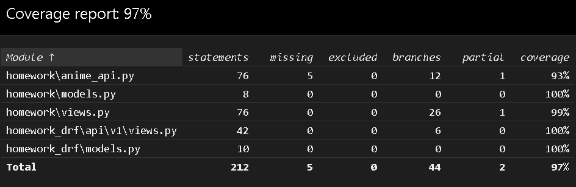

This is anime parser integred with Django.
API endpoints:  
  /books - Get all books from DB  
  /books/id - Get, put, delete a book from DB  
  /books/ - POST, create a new book. It takes data with 'title' and 'page_counter'  
  /anime - Get random anime from myanimelist.net  
  /anime-fact - Get random fact about random anime.  
  This was django REST API implementation.  
DRF endpoints:  
  /api/anime - GET, POST. POST Parameters:
    title: name of anime
    episodes: count of episodes
    rank: rating of anime
    genres: list of genres
    
  /api/genres - GET, POST. POST Parameters:
    genre: genre name
 
 For run service use: docker-compose -f docker-compose-dev.yml up --build (-d for daemon)  
 Testing coverage:
 
